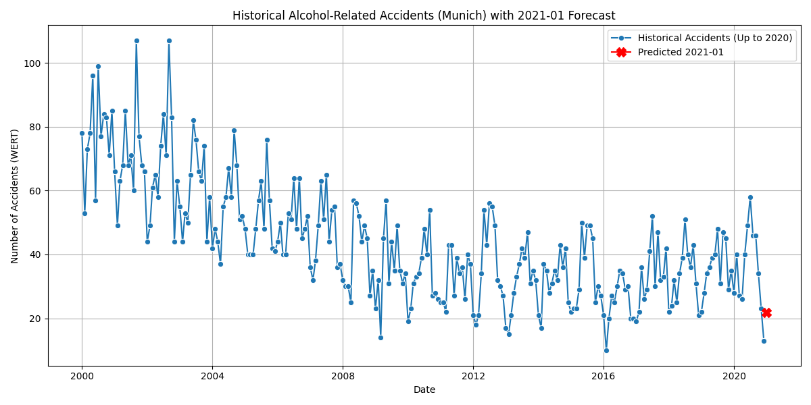

# 🚨 AI-Powered Munich Traffic Accident Predictor 🚦  
*A machine learning model to forecast alcohol-related accidents in Munich (2021) using historical data (pre-2021).*  

  

## 📌 Overview  
This project completes the **DPS AI Challenge** by:  
✅ **Cleaning and preprocessing** Munich’s traffic accident dataset (filtered to pre-2021 data).  
✅ **Training a Prophet time-series model** to predict accidents for *January 2021* (`Alkoholunfälle, insgesamt`).  
✅ **Deploying a FastAPI endpoint** hosted on Render.com.  
✅ **Computing error metrics** against actual 2021 data (optional validation).  


## 🚀 Features  
- **Data Pipeline**:  
  - Filters records post-2020 for consistency.  
  - Handles missing values and outliers.  
- **Forecasting Model**:  
  - Predicts alcohol-related accidents (`Alkoholunfälle, insgesamt`) for 2021.  
  - Supports custom year/month inputs via API.  
- **Live API**:  
  - Accepts JSON payloads (e.g., `{"year": 2021, "month": 1}`).  
  - Returns predictions (e.g., `{"prediction": 42}`).  

---

## ⚙️ Installation  
1. **Clone the repository**:  
   bash
   git clone https://github.com/iftiger25/ai-mvp-coach-challenge-munich-accidents.git
   cd ai-mvp-coach-challenge-munich-accidents

2. **Install dependencies:**
bash
pip install -r requirements.txt

##🏃 Usage
1. **Training the Model**
bash
python train.py --data_path ./data/verkehrsunfaelle.csv
(Outputs model weights and evaluation metrics.)

2. **Running the API Locally**
bash
uvicorn src.api:app --reload
Test the API:

bash
curl -X POST http://localhost:8000/predict \
  -H "Content-Type: application/json" \
  -d '{"year": 2021, "month": 1}'

Response:
json
{"prediction": 35}

3. **Live API Documentation**
🔗 Deployed API: https://dps-ai-challenge-n0s4.onrender.com/docs

1. API Endpoint
plaintext
POST https://dps-ai-challenge-n0s4.onrender.com/predict

#Input:

json
{
  "year": 2021,
  "month": 1
}

#Output:

json
{
  "prediction": 396.9
}
2. Live Test Results
Curl Command:

bash
curl -X 'POST' \
  'https://dps-ai-challenge-n0s4.onrender.com/predict' \
  -H 'accept: application/json' \
  -H 'Content-Type: application/json' \
  -d '{"year": 2021, "month": 1}'
Response:

Status Code: 200 (Success)

Prediction: 396.9 accidents forecasted for Jan 2021.

---
## 📂 Project Structure

```text
├── .gitignore
├── README.md
├── data/
│   └── monatszahlen_verkehrsunfaelle.csv
├── models/
│   └── prophet_model.joblib
├── outputs/
│   └── historical_accidents_forecast.png
├── src/
│   ├── app.py
│   └── main.py
└── requirements.txt.txt
└── README.md
```
---
## 🌐 Deployment
Tech Stack:
• Framework: FastAPI
• Model: Prophet (Facebook’s time-series library)
• Hosting: Render.com
---
## 🤝 Contributing
1. Fork the repository.
1. Open an issue or submit a PR with improvements.
---
## 📜 License
MIT
---
